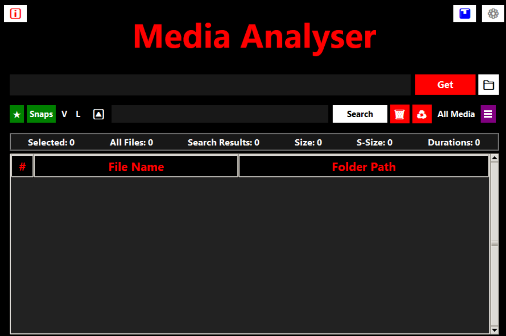

# Media Analyser


## Overview
The Media Player and Analyser Application is a Python-based desktop application designed to play video files with various control functionalities and Analyses user engagement. 

It helps users to keep track of their watch_time while watching movies or any videos.

It provides all the typical mediaplayer features such as playing, pausing, fast forwarding, rewinding, selecting files, saving favs. The application uses the Tkinter library for the graphical user interface (GUI) and the python-vlc library for video playback.

The Player Can Play Typical Media Files and Keep Stats tracking and Saving Your Favorites and Play Your Favorites in a easy and efficient way.

## Project Structure

The project follows a modular structure to separate concerns and improve maintainability:

- **gui_main.py**: Entry point for running the application.
- **category_manager.py**: Manages adding, updating and deleting user defined categories(playlist).
- **category_window.py**: GUI for category_manager for ease of use.
- **custom_messagebox.py**: Manages tkinter's messagebox display for errors and info.
- **deletion_manager.py**: Handles deletion of files through the file browser window.
- **favorites_manager.py**: Manages saving, removing, and reading favorites to/from a CSV file.
- **file_loader.py**: Handles file loading functionalities.
- **file_manager.py**: Manages file operations such as moving and renaming files.
- **default_settings.py**: Stores default application settings.
- **settings_manager.py**: Manages user and application settings.
- **snippets_manager.py**: Handles code or text snippets for the application.
- **image_player.py**: Handles the viewing of Snapshots taken through the player.
- **logs_writer.py**: Class which can be used to record update/error logs in a given file.
- **media_dashboard.py**: Displays media consumption statistics and dashboard visualizations using matplotlib and seaborn.
- **player_constants.py**: Contains pre-set constants necessary for the application.
- **static_methods.py**: Contains the helpful methods to be used by the Application.
- **summary_generator.py**: Generates summary in HTML file format for the recent session's watches.
- **video_progress_bar.py**: Manages the video progress bar widget.
- **video_stats.py**: Handles video playback statistics.
- **videoplayer.py**: Implements the main media player application. Contains all the methods for functionalities in Mediaplayer.
- **volume_bar.py**: Controls the volume adjustment widget.
- **watch_dictionary.py**: Defines the custom dictionary class for watch history.
- **watch_history_logger.py**: Logs watch history data to a CSV file.

### Other folders and files:
- **Screenshots/**: Stores screenshots taken during video playback.
- **Documentations/**: Contains documentation files and guides.
- **requirements.txt**: Lists Python dependencies required to run the application.
- **Readme.md**: Main project overview and quickstart guide.

## Requirements

- Python 3.8 or higher
- `tkinter` (usually included with Python, but may require separate installation on some systems)
- `python-vlc`
- `matplotlib`, `seaborn` (for statistics and dashboard features)
- See `requirements.txt` for the full list of dependencies

## Installation

1. Clone the repository to your local machine:

    ```bash
    git clone https://github.com/Demaurr/random-media-player.git
    ```

2. Navigate to the project directory:

    ```bash
    cd random-media-player
    ```

3. Install the required dependencies:

    ```bash
    pip install -r requirements.txt
    ```

4. Download and **install VLC Media Player**:
   The application uses `python-vlc`, which requires VLC Media Player to be installed on your system.  
   [Download VLC here](https://www.videolan.org/vlc/).  
   > Without VLC installed, video playback will not work.

5. (Optional, for video orientation filters) 
   To use the **"V"** (vertical) and **"L"** (landscape) filter buttons, you must have [FFmpeg](https://ffmpeg.org/download.html) installed and available in your system PATH.

## Functionality

* Walk the Given Folder using `os` library and get all the media files in the directory and its sub-directory.
* Keep Track of the All The Videos Watched related Info and store it in a **csv** through `watch_history_logger.py`.
* Records the Statistics for the Current Open Session and shows stats through `video_stats.py` in a separate window.
* Generates Summary in HTML Format Through The respective Button in **"Session Statistics"** window.

## Supported Video Formats

The player supports `.mp4`, `.mkv`, `.avi`, `.webm`, `.wmv`, `.flv`, `.mov` and `.m4v` files by default. You can add more formats in the `get_video_files` method in `videoplayer.py`.

## Keyboard Shortcuts

### In Media Player Window
| Shortcut                        | Action                                              |
|----------------------------------|-----------------------------------------------------|
| **`Alt + T`**                    | Toggle Always on Top on/off                         |
| **`B/b`**                        | Toggle subtitles on/off                             |
| **`Ctrl + B/b`**                 | Switch to next subtitle track                       |
| **`Ctrl + D/d`**                 | Remove from favorites                               |
| **`Ctrl + E/e`**                 | End the Trimming                                    |
| **`Ctrl + F/f`**                 | Add to favorites                                    |
| **`Ctrl + Right Arrow`**         | Play immediate next video in playlist               |
| **`Ctrl + Left Arrow`**          | Play immediate previous video in playlist           |
| **`Ctrl + S/s`**                 | Start the Section to Be Trimmed                     |
| **`Ctrl + Shift + Delete`**      | Remove current file from deletion list              |
| **`Delete`**                     | Mark current video for deletion                     |
| **`F/f`**                        | Toggle fullscreen                                   |
| **`Left Arrow`**                 | Rewind                                              |
| **`M/m`**                        | Mute and unmute the media                           |
| **`N/n`**                        | Play next video                                     |
| **`Right Arrow`**                | Fast forward                                        |
| **`Shift + A/a`**                | Open category manager                               |
| **`Shift + B/b`**                | Open filedialog box to add subtitle file            |
| **`Shift + Left Arrow`**         | Play previous video                                 |
| **`Shift + Right Arrow`**        | Play next video                                     |
| **`Shift + S/s`**                | Save screenshot (with filename and timestamp)       |
| **`Space`**                      | Pause/resume video                                  |
| **`Up Arrow`**                   | Increase volume                                     |
| **`Down Arrow`**                 | Decrease volume                                     |
| **`X/x`**                        | Cycle playback speed (1x, 1.5x, 1.5x, 1.75x, 2x)                 |
| **`,`**                          | Decrease subtitle delay                             |
| **`.`**                          | Increase subtitle delay                             |


### In File Browser Window
| Shortcut                        | Action                                              |
|----------------------------------|-----------------------------------------------------|
| **`Delete`**                     | Mark selected files for deletion                    |
| **`Shift + A/a`**                 | Open category manager                               |
| **`Ctrl + M/m`**                   | Move selected files                                 |
| **`Ctrl + F/f`**                   | Add selected files to favorites                     |
| **`Ctrl + D/d`**                   | Remove selected files from favorites                |
| **`Ctrl + Shift + Delete`**      | Remove selected files from deletion list            |
| **`Ctrl + Enter`**                | To play random media from the given folder        |


## Categories System
- The application includes a comprehensive category management system.
- Access categories via the "☰" button or using `Shift + A`.
- Features:
  - Add files to multiple categories
  - View all categories and their file counts
  - Double-click a category to view all files within it
  - Shows total size of files in each category


## Commands
- Type these commands in the `entry_box` of gui_main to get relevant results.

| Command | Description |
|---------|-------------|
| `show deletes` | Shows files marked for deletion |
| `show deleted` | Shows all files that have been deleted through the app |
| `show history` | Shows the history of watched media in the past 30 days |
| `show paths` | Shows all previously entered and available paths |
| `play favs` | Lists all the favorite media files |
| `show categories` | Shows all available categories and their contents |
| `folder path --update` | Updates the file list of the specified folder |


## Features

- **Video Playback**: Users can select and play video files from their local directories.
- **Playback Controls**: Provides controls for play, pause, stop, fast-forward, and rewind.
- **Manage Categories**: Allows you to save videos in different categories and playthem from there easily with having to explicitly typing folder path.
- **Watch History**: Keeps track of watched videos and their playback durations.
- **Statistics**: Displays statistics on watched videos, including total duration watched and frequency of playback.
- **View Snapshots**: View all the Snapshots taken from the Videoplayer in a built-in Image Viewer.
- **Customization**: Users can customize the application by selecting different video files, adjusting volume, and viewing playback progress.
- **Profile Management**: Users can create different profile by just changing the *FILE_FOLDER* in GUI settings and enjoy fresh profile.

## Statistics and Analytics
- **Media Dashboard**:
  - Monthly viewing trends
  - Duration category analysis
  - Visual graphs and charts
  - Comprehensive watch history analysis
- **Current Stats**: View statistics for current session without closing
- **Watch Time Tracking**:
  - Accurate tracking of actual watch time
  - Accounts for speed changes and skips
  - Maintains detailed watch history

## Usage

- Run the application from the root directory using:

    ```bash
    python gui_main.py
    ```

- Make sure to change the ***CONSTANT VARIABLES*** in `player_constants.py` as needed before running.
- Provide a **Folder Path** or relevant [Commands](#commands) for searching media files in the Entry Box (located at the top of the main window).
- Use the interface to select video files from your directories.
- Control video playback using the buttons/shortcuts provided (play, pause, rewind, fast forward, increase playback speed, etc.).
- **Current Stats** button will show the statistics(i.e. session duration total videos watched etc.) up to that point.
- **Play** button will restart the current video.
- Close the Media Player when finished.
- After closing, the session's watch statistics window will be shown.
- These statistics can be saved as an HTML file by clicking on the **Generate Summary** button.
- Use the **Snaps** button to view screenshots or get favorites.

> **Note:**  
> - Video playback requires VLC Media Player to be installed.  
> - The **"V"**, **"L"** filter buttons and snippets option in Mediaplayer require FFmpeg to be installed and accessible from your system PATH.

## Session Statistics & Summary Reports

After closing the player, a session statistics window appears, showing:
- Each video watched (with folder)
- Total watch time per video
- Number of times watched
- Session duration

## Known Issues & Limitations

- Some advanced video codecs may not be supported if VLC is not installed properly.
- Large folders with thousands of videos may cause slow loading.
- Watch time is based on playback segments and may not be 100% accurate if the app is force-closed.
- Might Hang if the CPU is slow.

## Troubleshooting & FAQ

**Q:** The player doesn't start or crashes on launch.  
**A:** Ensure you have Python 3.8+, `tkinter`, and `python-vlc` installed. Also, make sure VLC media player is installed on your system.

**Q:** Videos do not play or are not found.  
**A:** Check that the folder path you provide contains supported video files and that you have permission to access them.

**Q:** Statistics or dashboard features do not work.  
**A:** Ensure `matplotlib` and `seaborn` are installed. See `requirements.txt` for all dependencies.

**Q:** VLC is installed but videos still do not play.  
**A:** Make sure VLC is added to your system PATH and is the correct architecture (32/64-bit) matching your Python installation.

**Q:** Not getting the video snippets in All Media Files
**A:** It's designed to be like that. You can find them in Category of Trimmed Videos. 

## Contributing

Contributions to the Media Player Application are welcome! If you have any suggestions, bug fixes, or feature requests, please open an issue or submit a pull request on GitHub.

- Follow PEP8 coding style where possible.
- Add new features as separate modules and integrate them in `gui_main.py` or `videoplayer.py`.
- Update the documentation and keyboard shortcuts as needed.
- Add or update tests in the `tests/` directory if applicable.

## Acknowledgments

Special thanks to the developers of the Tkinter and python-vlc libraries and [makeuseof](https://www.makeuseof.com/python-video-media-player-how-to-build/) site for their contributions to open-source software.

## Future Enhancements
* Displaying properties for each media files.
* Sorting my Duration or giving the user Duration related info.
* Record Sessions info for better time management.

