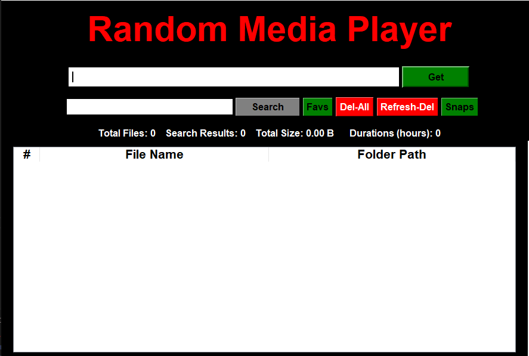

# Random Media Player

## Table of Contents 
 - [Introduction](#introduction) 
 - [Installation](#installation)  
 -  [Features](#features) 
 -  [Usage](#usage)
 -  [Contributing](#contributing)
 -  [Acknowledgments](#acknowledgments)


## Introduction
Random Video Player to Keep Track of Your Watchtime for local Media Consumption. The video extensions supported **avi, mp4, mkv, m4v, mov, webm, wvm, flv**


## Installation

1. Clone the repository to your local machine:

    ```bash
    git clone https://github.com/Demaurr/random-media-player.git
    ```

2. Navigate to the project directory:

    ```bash
    cd random-media-player
    ```

3. Install the required dependencies:

    ```bash
    pip install -r requirements.txt
    ```


## Features

- **Video Playback**: Users can select and play video files from their local directories.
- **Playback Controls**: Provides controls for play, pause, stop, fast-forward, and rewind.
- **Saving Favorites**: Save Favorite Media or Screen Capture in Your Defined Folder.
- **Watch History**: Keeps track of watched videos and their playback durations.
- **Image Viewing**: View Screen Captures in a Separate Image Viewer.
- **Statistics**(TBA): Displays statistics on watched videos, including total duration watched and frequency of playback.
- **Customization**: Users can customize the application by selecting different video files, adjusting volume, and viewing playback progress.
- **Deletion**: Users can Delete a file and queue it to deletion_list and send it to the recyclebin when feels right.
- **Moving**: Users can Move a file to any directory within this app without affecting file's status, if it's in a favorites or deletion list then moving won't affect them.

## Usage
*   Change the ***CONSTANT VARIABLES*** in `player_constants.py` and defined you PATHS for respective files.
### For Using **gui_main.py** (Recommended)
*   Run `gui_main.py` if you don't want to interact through cmd and provide **path(s)** in the app's search entry in order to list all the Media Under it.
*  You can input **play favs** in order to list/play from your saved favorites.
* Viewing the Images from Your Stated Folder ***default is SCREENSHOTS_FOLDER***.
*   After `gui_main.py` double-click on any file you want to start player from.
*   All The functionalities working with main.py would Also Work with this (like Screen Captures, Adding Favs etc.)
*   Use the Keyboard Shortcuts Stated in Documentation for easier Playing Controls.

### For Using main.py (Deprecated)
*   Run `main.py`, through `py main.py`, to launch the application.
*   Provide a **Folder Path(s)** To Search media files under the Path **cmd** as input.
*   (Optional) input **play favs** to start playing random media from your saved favorites.
*   Use the cmd interface to select video files from your directories.
*   Control video playback using the buttons provided (play, pause, rewind, fast forward, etc.).
*   **Current Stats** button will show the Statistic uptill that point.
*   **Play** button will restart the current video.
*   Save Screen Capture By Using *Keyboard-Shortcut* **Shift-S**.
*   Add or Remove Files From the Favorites using `Fav +` and `Fav -` Buttons Respectively, Or Use Keyboard Shorcuts (defined [here](Documentations/documentation.md))
*   Close the application when finished.
*   After closing The Sessions Watch Statistics Window will be Shown.
*   These Statistics can be saved by clicking on **Generate Summary** Button.

## Contributing

Contributions to the Media Player Application are welcome! If you have any suggestions, bug fixes, or feature requests, please feel free to open an issue or submit a pull request on GitHub.

## Acknowledgments

Special thanks to the developers of the Tkinter and python-vlc libraries and [makeuseof](https://www.makeuseof.com/python-video-media-player-how-to-build/) for their contributions to open-source software.


