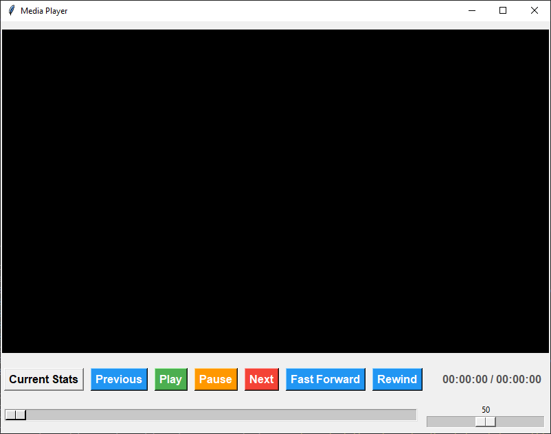

# Random Media Player

## Table of Contents 
 - [Introduction](#introduction) 
 - [Installation](#installation)  
 -  [Features](#features) 
 -  [Usage](#usage)
 -  [Contributing](#contributing)
 -  [Acknowledgments](#acknowledgments)


## Introduction
Random Video Player to Keep Track of Your Watchtime for local Media files. The video extensions supported **avi, mp4, mkv, m4v, webm.**


## Installation

1. Clone the repository to your local machine:

    ```bash
    git clone https://github.com/Demaurr/random-media-player.git
    ```

2. Navigate to the project directory:

    ```bash
    cd random-media-player
    ```

3. Install the required dependencies:

    ```bash
    pip install -r requirements.txt
    ```


## Features

- **Video Playback**: Users can select and play video files from their local directories.
- **Playback Controls**: Provides controls for play, pause, stop, fast-forward, and rewind.
- **Watch History**: Keeps track of watched videos and their playback durations.
- **Statistics**: Displays statistics on watched videos, including total duration watched and frequency of playback.
- **Customization**: Users can customize the application by selecting different video files, adjusting volume, and viewing playback progress.

## Usage
*   Change the ***CONSTANT VARIABLES*** in `videoplayer.py`, `summary_generator.py` to set the Path you want to store record files.
*   (Optional) create a `file_info.txt` and store a path for **Watched_History.csv** to be stored someother place.
*   Then Run `main.py`, through `py main.py`, to launch the application.
*   Provide a **Folder Path(s)** To Search media files under the Path **cmd** as input.
*   Use the interface to select video files from your directories.
*   Control video playback using the buttons provided (play, pause, rewind, fast forward, etc.).
*   **Current Stats** button will show the Statistic uptill that point.
*   **Play** button will restart the current video.
*   Close the application when finished.
*   After closing The Sessions Watch Statistics Window will be Shown.
*   These Statistics can be saved by clicking on **Generate Summary** Button.

## Contributing

Contributions to the Media Player Application are welcome! If you have any suggestions, bug fixes, or feature requests, please feel free to open an issue or submit a pull request on GitHub.

## Acknowledgments

Special thanks to the developers of the Tkinter and python-vlc libraries and [makeuseof](https://www.makeuseof.com/python-video-media-player-how-to-build/) site for their contributions to open-source software.


