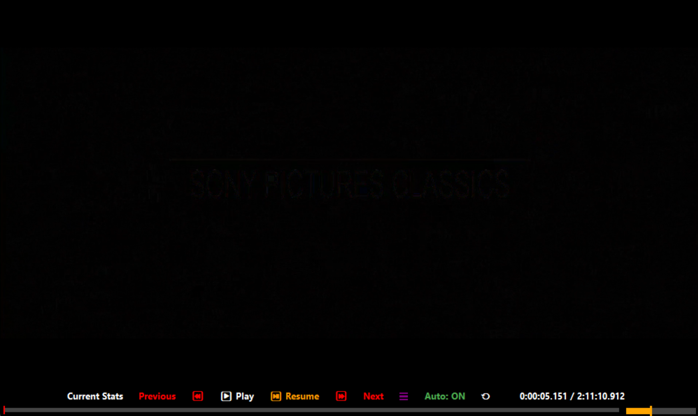
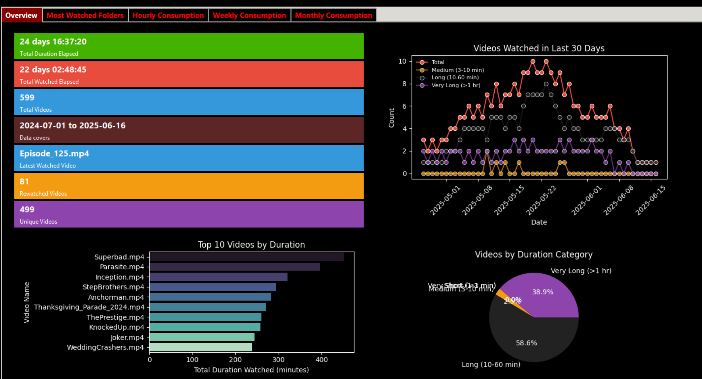
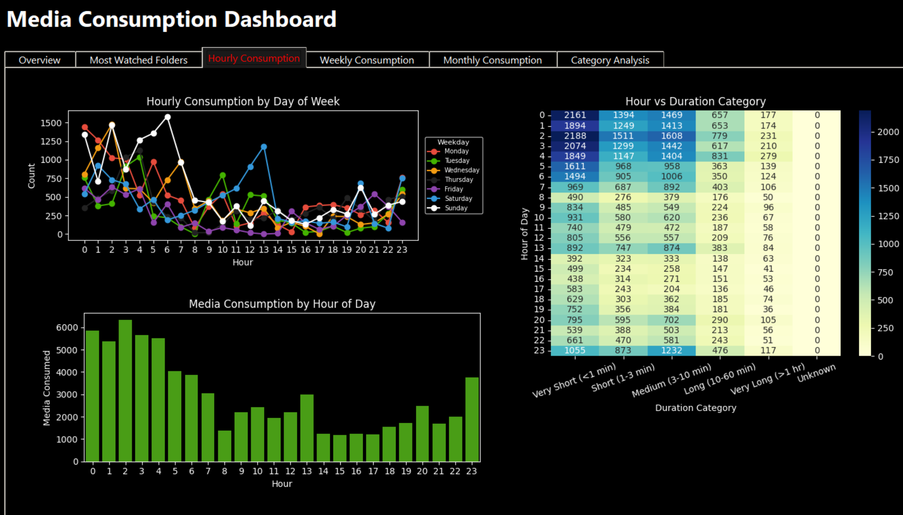
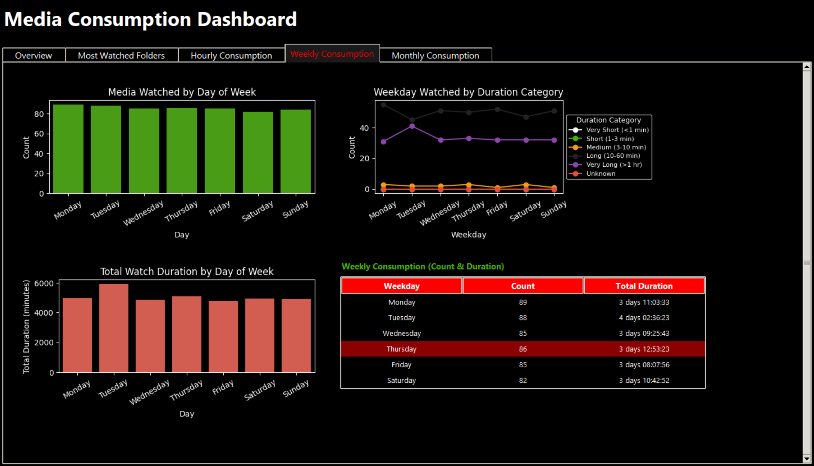

# Random Media Analyser 


## Overview

**Random Media Analyser** is a Python-based desktop application for playing local video files, tracking your watch time, and managing your media library. It features all the conventional video playing options with an addition to the analysing of media consumption.

Supported video formats include: **avi, mp4, mkv, m4v, mov, webm, wmv, flv, gif**.

For full details, advanced features, keyboard shortcuts, troubleshooting, and contributing guidelines, please see the [Documentation](Documentations/documentation.md).

Download the zip from the tags for stable version.

---

## Installation

1. **Clone the repository:**
    ```bash
    git clone https://github.com/Demaurr/random-media-player.git
    ```

2. **Navigate to the project directory:**
    ```bash
    cd random-media-player
    ```

3. **Install dependencies:**
    ```bash
    pip install -r requirements.txt
    ```

4. **Download VLC Media Player:**  
   This application uses `python-vlc`, which requires the VLC Media Player and its libraries to be installed on your system.  
   **Download and install VLC from:** [https://www.videolan.org/vlc/](https://www.videolan.org/vlc/)  
   > Without VLC installed, video playback will not work.

5. **FFmpeg Requirement**: Some features (video trimming, vertical/horizontal detection) require [FFmpeg](https://ffmpeg.org/download.html) to be installed and available in your system PATH.

6. **Create Batch File**:  
   Once everything is installed, run `generate_batch_file.py`.  
   It will automatically create a `Random Media Analyser.bat` file on your Desktop.  
   You can use this `.bat` file to launch the app anytime without needing to open `gui_main.py` manually.
---

## What's New in v3.7.0

- **Fingerprint-based system** for reliable media tracking across renames and moves
- **Annotations in video player** with timeline markers and tooltips
- **Grouped Properties View** for multi-file insights and batch metadata
- **Async Dashboard loading** for faster startup and smoother UI
- **Massive performance improvements** with indexing (screenshots, snippets, watch history)
- **Centralized CSV schema system (`CSV_CONFIG`)** for consistency and easier maintenance
- **Improved dependency management** and cleaner initialization across modules

### Performance Improvements

- Screenshot lookup reduced from ~0.2s per file → ~0.0002s using indexing (~99.9% faster)
- Snippet retrieval optimized using O(1) indexing
- Watch history analytics use in-memory aggregation for instant results
- Batch loading reduces repeated disk I/O operations

### ⚠️ Migration Notice (v3.7.0)
CSV schemas have changed (new fingerprint/index fields)
Existing data may be auto-migrated
### ⚠️ Backup your CSV files before upgrading

---

## Screenshots


---

## Dashboard Screenshots

The **Dashboard** provides a visual summary of your media activity and library. Below are some example dashboard screens and what they show:

### Overview

- **Overview of Media Consumption:**
  Shows the summary of media consumption with listing the trend of Past 30 days.

### Hourly Consumption



- **Media Consumption by Hour of Day:**  
  Shows at what hours you most frequently watch media, helping you spot your peak viewing times.
- **Hour vs Duration Category:**  
  A heatmap showing how many videos of each duration category (short, medium, long, etc.) are watched at each hour.

---

### Weekly Consumption



- **Media Watched by Day of Week:**  
  Bar chart showing how many videos are watched on each weekday.
- **Weekday Watched by Duration Category:**  
  Line chart showing trends for each duration category across the week.
- **Total Watch Duration by Day of Week:**  
  Bar chart of total minutes watched per weekday.
- **Weekly Consumption Table:**  
  Table summarizing the count and total duration watched for each weekday.

---

These dashboards help you understand your viewing habits, spot trends, and manage your media consumption more effectively.


## Main Features

- **Video Playback:** Play videos with full playback controls (play, pause, seek, speed).
- **Annotations System:** Add timestamp-based annotations directly on the video timeline with hover tooltips.
- **Watch History & Analytics:** Track viewing habits with detailed statistics and dashboard insights.
- **Dashboard (Async):** Visualize media consumption with charts (hourly, weekly, trends).
- **Fingerprint-Based Tracking:** Files are tracked using content hashes, so renames/moves don’t break metadata.
- **Grouped Properties View:** View combined metadata (notes, categories, stats, screenshots) for multiple files.
- **Categories & Favorites:** Organize and quickly access your media.
- **Notes & Descriptions:** Attach rich metadata to files.
- **File Associations:** Link related media together.
- **Video Trimming (Snippets):** Extract clips using FFmpeg.
- **Screenshot Management:** Capture and browse thumbnails efficiently.
- **High-Performance Indexing:** Near-instant lookups using in-memory indexes.
- **File Management:** Move, organize, or mark files for deletion.
- **Session Statistics:** Analyze usage patterns over time.

---

## Usage

1. **Configure Paths:**  
   Edit `player_constants.py` to set your preferred folders for media, screenshots, and logs.

2. **Launch the Application:**  
   Run the GUI version (recommended):
   ```bash
   python gui_main.py
   ```
   - Enter a folder path in the search box to list all media files.
   - Use the interface or keyboard shortcuts for playback and management.
   - Double-click a file to start playback.
   - Access favorites, screenshots, and statistics from within the app.
   - View How to guide in the App for more details. Or see [full documentation](Documentations/documentation.md).

3. **Command-Line Mode (Optional/Deprecated):**  
   Run `main.py` for a command-line interface:
   ```bash
   python main.py
   ```
   - Follow prompts to select and play media.

---

## Project Structure

The project follows a modular structure to separate concerns and improve maintainability:

- **`Documentations/`**: Contains detailed documentation and usage guides.  
- **`Screenshots/`**: Example screenshots for UI and dashboard features.  
- **`gui_main.py`**: Launches the main graphical interface.  
- **`main.py`**: Command-line mode (legacy).  
- **`videoplayer.py`**: Handles video playback and controls.  
- **`file_loader.py`**: Loads and indexes media files.  
- **`category_manager.py`**: Organizes files into categories.  
- **`associations_manager.py`**: Associate related files.
- **`notes_manager.py`**: Manages notes and descriptions for media.  
- **`snippets_manager.py`**: Supports video trimming and snippet management.  
- **`image_player.py`**: Displays screenshots and images.  
- **`player_constants.py`**: Stores configuration settings and constants.  
- **`requirements.txt`**: Lists required Python packages.  
- **`watch_history_logger.py`**: Tracks and analyzes viewing data.
- **`annotations_manager.py`**: Handles video annotations.
- **`grouped_properties_window.py`**: Multi-file metadata viewer.
- **`dashboard/`**: Dashboard logic and plotting system.

## More Information

- **Keyboard Shortcuts**
- **Advanced Commands**
- **Troubleshooting**
- **Contributing**

See the [full documentation](Documentations/documentation.md) for details on all features, usage tips, and development guidelines.

See the [Changelog](Logs/Changelog.md) for release history.
